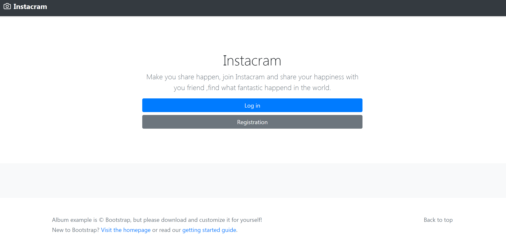
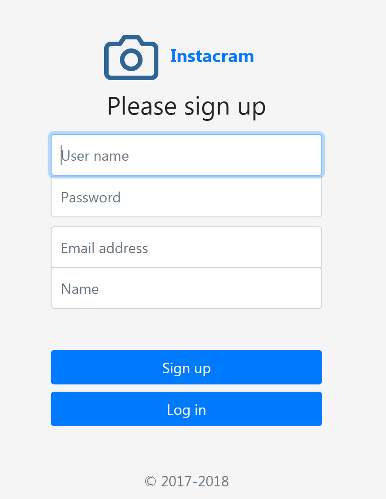
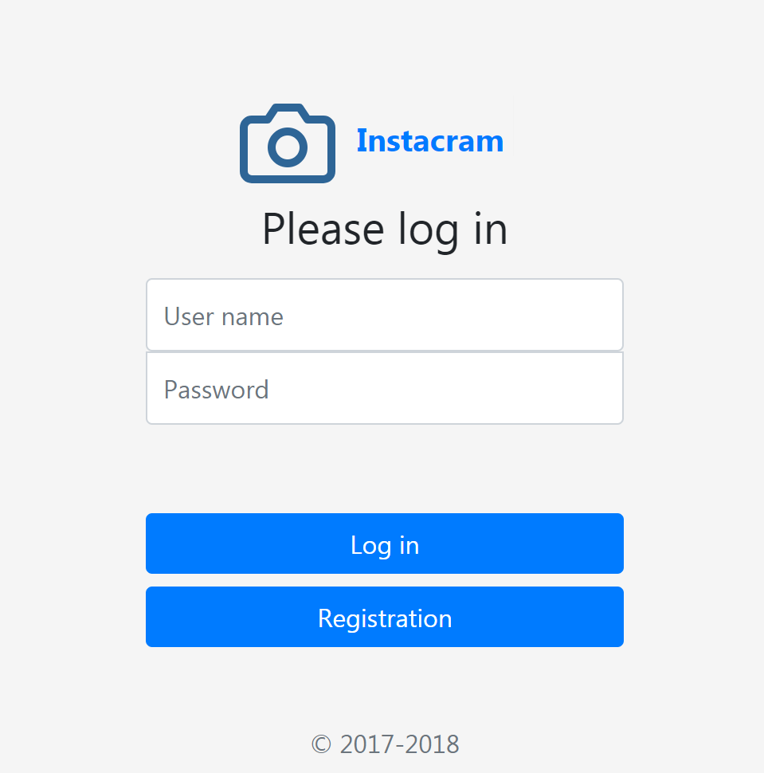
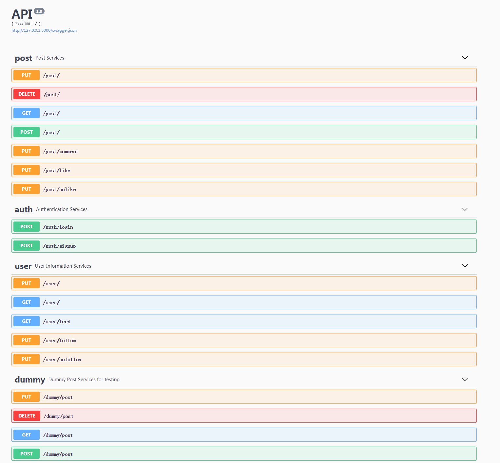

## Introduction

JavaScript is used increasingly to provide a native-like application experience in the web. One
major avenue of this has been in the use of Single Page Applications or SPAs. SPAs
are generated, rendered, and updated using JavaScript. Because SPAs don't require a user
to navigate away from a page to do anything, they retain a degree of user and application state.

There are millions of websites that utilise SPAs in part of, or all of their web applications.

Some of the skills/concepts this project aims to and build upon:

* Simple event handling (buttons)
* Advanced Mouse Events (Swipe)
* Fetching data from an API
* Infinite scroll
* CSS Animations
* Web Workers
* Push Notifications (Polling)
* Offline Support
* Routing (URL fragment based routing)

    
    

